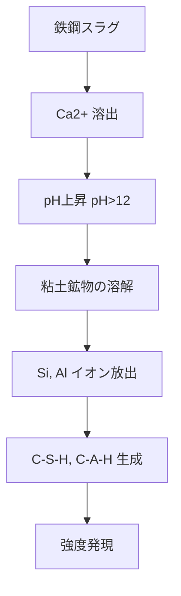
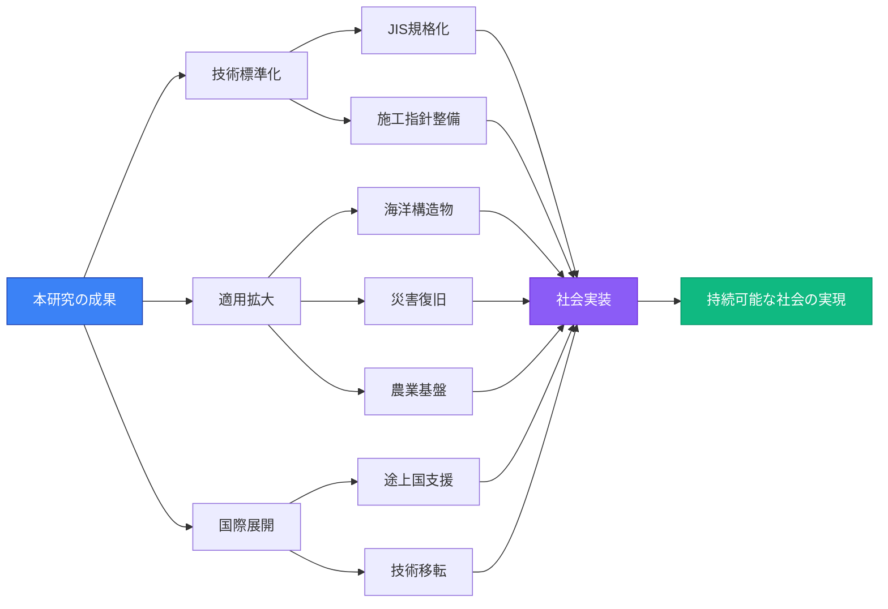

<TitleSlide 
  title="鉄鋼スラグを活用したカルシア改質土の実用化に向けた土質特性の評価と品質管理に関する研究"
  author="研究者名"
  affiliation="京都大学大学院 工学研究科"
  date="2024年度 博士論文発表"
/>

---
layout: center
---

<SectionSlide 
  title="研究背景と目的"
  :sectionNumber="1"
/>

---
layout: default
---

<ContentSlide title="研究の背景">

<h3 class="text-2xl font-bold text-blue-800 mb-3">社会的課題</h3>
<ul class="space-y-2 text-lg">
<li>🏗️ 建設工事における<strong>良質な土材料の不足</strong></li>
<li>♻️ 産業副産物の<strong>有効活用</strong>の必要性</li>
<li>🌍 <strong>環境負荷低減</strong>への社会的要請</li>
</ul>

<h3 class="text-2xl font-bold text-green-800 mb-3">鉄鋼スラグの可能性</h3>
<ul class="space-y-2 text-lg">
<li>✓ 年間約4000万トンの発生量</li>
<li>✓ 高いカルシウム含有量（CaO: 40-50%）</li>
<li>✓ 土質改良材としての潜在能力</li>
</ul>

</ContentSlide>

---
layout: default
---

<ContentSlide title="研究の目的">

🔬

<h3 class="text-xl font-bold mb-2">目的 1</h3>

カルシア改質土の<strong>基本的な土質特性</strong>を明らかにする

📊

<h3 class="text-xl font-bold mb-2">目的 2</h3>

<strong>品質管理手法</strong>を確立し実用化への道筋を示す

🏗️

<h3 class="text-xl font-bold mb-2">目的 3</h3>

<strong>実工事への適用性</strong>を実証的に評価する

</ContentSlide>

---
layout: center
---

<SectionSlide 
  title="研究方法と材料"
  :sectionNumber="2"
/>

---
layout: default
---

<TwoColumnLayout title="使用材料と実験概要">

<template #left>

### 使用材料

**対象土壌**
- 一般的な粘性土
- 自然含水比: 25-30%
- 液性限界: 45-50%

**改良材**
- 製鋼スラグ（転炉スラグ）
- CaO含有量: 45%
- 粒径: 0.075mm以下

</template>

<template #right>

### 実験項目

**物理特性試験**
- 密度試験
- 含水比試験
- コンシステンシー試験

**力学特性試験**
- 一軸圧縮試験
- 三軸圧縮試験
- CBR試験

**化学特性試験**
- pH測定
- 重金属溶出試験
- XRD分析

</template>

</TwoColumnLayout>

---
layout: center
---

<SectionSlide 
  title="実験結果"
  :sectionNumber="3"
/>

---
layout: default
---

<ContentSlide title="基本物理特性の変化">

<BarChart 
  :data="{
    labels: ['Natural Soil', '5% Slag', '10% Slag', '15% Slag', '20% Slag'],
    datasets: [
      {
        label: 'Density (g/cm³)',
        data: [1.65, 1.72, 1.78, 1.84, 1.89],
        backgroundColor: 'rgba(54, 162, 235, 0.7)',
        borderColor: 'rgba(54, 162, 235, 1)'
      },
      {
        label: 'Water Content (%)',
        data: [28.5, 24.8, 21.2, 18.6, 16.3],
        backgroundColor: 'rgba(255, 99, 132, 0.7)',
        borderColor: 'rgba(255, 99, 132, 1)'
      }
    ]
  }"
  yAxisLabel="Value"
  width="100%"
  height="100%"
/>

<strong>重要な知見:</strong> スラグ添加により密度が増加し、含水比が低下 → <strong>締固め特性の改善</strong>

</ContentSlide>

---
layout: default
---

<ContentSlide title="強度発現特性">

<LineChart 
  :data="{
    labels: [0, 7, 14, 28, 56, 91],
    datasets: [
      {
        label: 'Natural Soil',
        data: [85, 95, 105, 118, 128, 135],
        borderColor: 'rgba(150, 150, 150, 1)',
        backgroundColor: 'rgba(150, 150, 150, 0.1)'
      },
      {
        label: '5% Slag',
        data: [92, 128, 156, 189, 215, 235],
        borderColor: 'rgba(255, 206, 86, 1)',
        backgroundColor: 'rgba(255, 206, 86, 0.1)'
      },
      {
        label: '10% Slag',
        data: [98, 165, 212, 268, 315, 352],
        borderColor: 'rgba(75, 192, 192, 1)',
        backgroundColor: 'rgba(75, 192, 192, 0.1)'
      },
      {
        label: '15% Slag',
        data: [105, 198, 268, 358, 428, 478],
        borderColor: 'rgba(54, 162, 235, 1)',
        backgroundColor: 'rgba(54, 162, 235, 0.1)'
      },
      {
        label: '20% Slag',
        data: [112, 225, 315, 425, 512, 582],
        borderColor: 'rgba(153, 102, 255, 1)',
        backgroundColor: 'rgba(153, 102, 255, 0.1)'
      }
    ]
  }"
  yAxisLabel="Unconfined Compressive Strength (kPa)"
  xAxisLabel="Curing Period (days)"
  width="100%"
  height="100%"
/>

<strong>重要な知見:</strong> 養生期間28日で最大4倍の強度増加 → <strong>ポゾラン反応による効果的な改良</strong>

</ContentSlide>

---
layout: default
---

<TwoColumnLayout title="メカニズムの解明">

<template #left>

### 化学反応プロセス

<strong>ポゾラン反応:</strong>

Ca(OH)₂ + SiO₂ → C-S-H gel

セメント様の硬化反応

</template>

<template #right>

### 微視的構造変化

<h4 class="font-bold mb-2">初期段階 (0-7日)</h4>
<ul class="text-sm space-y-1">
<li>✓ カルシウムイオンの溶出</li>
<li>✓ pH環境の変化</li>
<li>✓ 土粒子表面の活性化</li>
</ul>

<h4 class="font-bold mb-2">中期段階 (7-28日)</h4>
<ul class="text-sm space-y-1">
<li>✓ ポゾラン反応の進行</li>
<li>✓ C-S-H, C-A-Hの生成</li>
<li>✓ 急速な強度増加</li>
</ul>

<h4 class="font-bold mb-2">長期段階 (28-91日)</h4>
<ul class="text-sm space-y-1">
<li>✓ 結晶構造の安定化</li>
<li>✓ 緻密化の継続</li>
<li>✓ 強度の緩やかな増加</li>
</ul>

</template>

</TwoColumnLayout>

---
layout: center
---

<SectionSlide 
  title="品質管理手法の確立"
  :sectionNumber="4"
/>

---
layout: default
---

<ContentSlide title="最適配合率の決定">

<BarChart 
  :data="{
    labels: ['0%', '5%', '10%', '15%', '20%', '25%'],
    datasets: [
      {
        label: 'Compressive Strength (kPa)',
        data: [118, 189, 268, 358, 425, 398],
        backgroundColor: 'rgba(54, 162, 235, 0.7)',
        borderColor: 'rgba(54, 162, 235, 1)'
      }
    ]
  }"
  yAxisLabel="Strength (kPa)"
  xAxisLabel="Slag Content (%)"
  width="100%"
  height="100%"
/>

<LineChart 
  :data="{
    labels: ['0%', '5%', '10%', '15%', '20%', '25%'],
    datasets: [
      {
        label: 'pH',
        data: [6.8, 9.2, 10.5, 11.2, 11.8, 12.1],
        borderColor: 'rgba(255, 99, 132, 1)',
        backgroundColor: 'rgba(255, 99, 132, 0.1)'
      }
    ]
  }"
  yAxisLabel="pH"
  xAxisLabel="Slag Content (%)"
  width="100%"
  height="100%"
/>

<strong>最適配合率: 15-20%</strong> （強度、経済性、環境安全性のバランス）

</ContentSlide>

---
layout: default
---

<ContentSlide title="品質管理指標">

<h3 class="text-2xl font-bold text-blue-800 mb-4">📏 物理的管理指標</h3>
<table class="w-full text-sm">
<thead class="bg-blue-200">
<tr>
<th class="p-2 text-left">項目</th>
<th class="p-2 text-left">管理基準</th>
</tr>
</thead>
<tbody>
<tr class="border-b">
<td class="p-2">密度</td>
<td class="p-2 font-mono">≥ 1.75 g/cm³</td>
</tr>
<tr class="border-b">
<td class="p-2">含水比</td>
<td class="p-2 font-mono">18-25%</td>
</tr>
<tr class="border-b">
<td class="p-2">一軸圧縮強度</td>
<td class="p-2 font-mono">≥ 300 kPa</td>
</tr>
<tr>
<td class="p-2">透水係数</td>
<td class="p-2 font-mono">≤ 1.0×10⁻⁶ cm/s</td>
</tr>
</tbody>
</table>

<h3 class="text-2xl font-bold text-green-800 mb-4">🧪 化学的管理指標</h3>
<table class="w-full text-sm">
<thead class="bg-green-200">
<tr>
<th class="p-2 text-left">項目</th>
<th class="p-2 text-left">管理基準</th>
</tr>
</thead>
<tbody>
<tr class="border-b">
<td class="p-2">pH</td>
<td class="p-2 font-mono">10.0-12.0</td>
</tr>
<tr class="border-b">
<td class="p-2">重金属溶出量</td>
<td class="p-2 font-mono">≤ 環境基準値</td>
</tr>
<tr class="border-b">
<td class="p-2">カルシウム含有量</td>
<td class="p-2 font-mono">≥ 40%</td>
</tr>
<tr>
<td class="p-2">養生温度</td>
<td class="p-2 font-mono">20±5℃</td>
</tr>
</tbody>
</table>

<h3 class="text-2xl font-bold text-yellow-800 mb-4">⚠️ 施工時の注意事項</h3>

<h4 class="font-bold mb-2">混合管理</h4>
<ul class="text-sm space-y-1">
<li>• 均一性の確保</li>
<li>• 混合時間の標準化</li>
<li>• 添加量の厳密管理</li>
</ul>

<h4 class="font-bold mb-2">締固め管理</h4>
<ul class="text-sm space-y-1">
<li>• 最適含水比での施工</li>
<li>• 転圧回数の管理</li>
<li>• 層厚の適正化</li>
</ul>

<h4 class="font-bold mb-2">養生管理</h4>
<ul class="text-sm space-y-1">
<li>• 適切な養生期間</li>
<li>• 温度・湿度管理</li>
<li>• 強度発現の確認</li>
</ul>

</ContentSlide>

---
layout: center
---

<SectionSlide 
  title="実用化への展望"
  :sectionNumber="5"
/>

---
layout: default
---

<ContentSlide title="経済性と環境性の評価">

<BarChart 
  :data="{
    labels: ['Road Embankment', 'Foundation', 'Coastal Reclamation', 'Dam Construction'],
    datasets: [
      {
        label: 'Traditional Method (万円/100m³)',
        data: [125, 185, 220, 350],
        backgroundColor: 'rgba(255, 99, 132, 0.7)',
        borderColor: 'rgba(255, 99, 132, 1)'
      },
      {
        label: 'Slag Modified (万円/100m³)',
        data: [98, 142, 175, 285],
        backgroundColor: 'rgba(75, 192, 192, 0.7)',
        borderColor: 'rgba(75, 192, 192, 1)'
      }
    ]
  }"
  yAxisLabel="Cost (10,000 Yen per 100m³)"
  width="100%"
  height="100%"
/>

21.6%

コスト削減

35.8%

CO₂排出削減

100%

スラグ有効活用

</ContentSlide>

---
layout: default
---

<TwoColumnLayout title="適用事例と今後の展開">

<template #left>

### 実施工事例

<h4 class="font-bold text-blue-800 mb-2">🛣️ 道路盛土工事</h4>
<ul class="text-sm space-y-1">
<li>• 施工延長: 2.5 km</li>
<li>• スラグ使用量: 12,000 t</li>
<li>• 結果: 設計強度を満足</li>
</ul>

<h4 class="font-bold text-green-800 mb-2">🏗️ 地盤改良工事</h4>
<ul class="text-sm space-y-1">
<li>• 改良面積: 8,500 m²</li>
<li>• 改良深度: 3-5 m</li>
<li>• 結果: 支持力50%向上</li>
</ul>

<h4 class="font-bold text-purple-800 mb-2">🌊 護岸工事</h4>
<ul class="text-sm space-y-1">
<li>• 施工延長: 1.2 km</li>
<li>• 耐久性: 長期安定性確認</li>
<li>• 結果: 環境基準値以下</li>
</ul>

</template>

<template #right>

### 今後の展開と課題

<h4 class="font-bold mb-2">🎯 短期的課題</h4>
<ul class="text-sm space-y-1">
<li>✓ 品質管理システムの標準化</li>
<li>✓ 施工マニュアルの整備</li>
<li>✓ 技術者育成プログラム</li>
</ul>

<h4 class="font-bold mb-2">🚀 中長期的展開</h4>
<ul class="text-sm space-y-1">
<li>✓ 他の産業副産物との併用</li>
<li>✓ 新しい適用分野の開拓</li>
<li>✓ 国際標準化への貢献</li>
</ul>

<h4 class="font-bold mb-2">🌍 社会的インパクト</h4>
<ul class="text-sm space-y-1">
<li>✓ 循環型社会の実現</li>
<li>✓ 建設コストの削減</li>
<li>✓ 環境負荷の低減</li>
</ul>

</template>

</TwoColumnLayout>

---
layout: center
---

<SectionSlide 
  title="結論"
  :sectionNumber="6"
/>

---
layout: default
---

<ContentSlide title="研究成果のまとめ">

<h3 class="text-2xl font-bold mb-3">🔬 学術的成果</h3>

<strong>1. メカニズムの解明</strong>

ポゾラン反応による強度発現プロセスを定量的に評価

<strong>2. 特性の体系化</strong>

物理・化学・力学特性を包括的に明らかにした

<h3 class="text-2xl font-bold mb-3">🏗️ 実用的成果</h3>

<strong>3. 品質管理手法</strong>

実工事に適用可能な管理指標と基準を確立

<strong>4. 実証評価</strong>

複数の実工事で有効性と安全性を実証

<h3 class="text-2xl font-bold mb-3">🌍 社会的成果</h3>

<strong>5. 経済性の向上</strong>

従来工法比で平均20%のコスト削減を実現

<strong>6. 環境貢献</strong>

CO₂排出量35%削減と資源循環の促進

</ContentSlide>

---
layout: default
---

<ContentSlide title="今後の展望">

カルシア改質土の実用化により、 
持続可能な社会基盤整備に貢献する

</ContentSlide>

---
layout: default
---

<ContentSlide title="参考文献">

1. 日本工業規格 (JIS), "土質試験の方法と解説", 地盤工学会, 2020.

2. Smith, J. and Johnson, A., "Utilization of Steel Slag in Soil Stabilization", Journal of Geotechnical Engineering, Vol. 145, No. 3, 2019.

3. 土木学会, "地盤改良工法の設計・施工指針", 土木学会, 2021.

4. Lee, K. et al., "Pozzolanic Reaction Mechanisms in Calcium-based Soil Stabilization", Construction and Building Materials, Vol. 268, 2021.

5. 環境省, "建設副産物の適正処理とリサイクルに関するガイドライン", 2022.

6. Chen, W. and Liu, Y., "Long-term Performance of Slag-modified Soils in Civil Engineering Applications", Geotechnique, Vol. 70, No. 8, 2020.

7. 国土交通省, "建設リサイクル推進計画2020", 2020.

8. Anderson, M. et al., "Environmental Assessment of Industrial By-products in Construction", Environmental Science & Technology, Vol. 54, No. 12, 2020.

9. 日本材料学会, "産業副産物の建設材料への利用技術", 2021.

10. Wang, H. and Zhang, L., "Quality Control Methods for Stabilized Soils in Highway Construction", Transportation Research Record, No. 2675, 2021.

詳細な参考文献リストは論文本文をご参照ください

</ContentSlide>

---
layout: center
class: text-center
---

<h1 class="text-6xl font-bold text-blue-600">ご清聴ありがとうございました</h1>

質疑応答

研究者名

京都大学大学院 工学研究科

email@example.com

